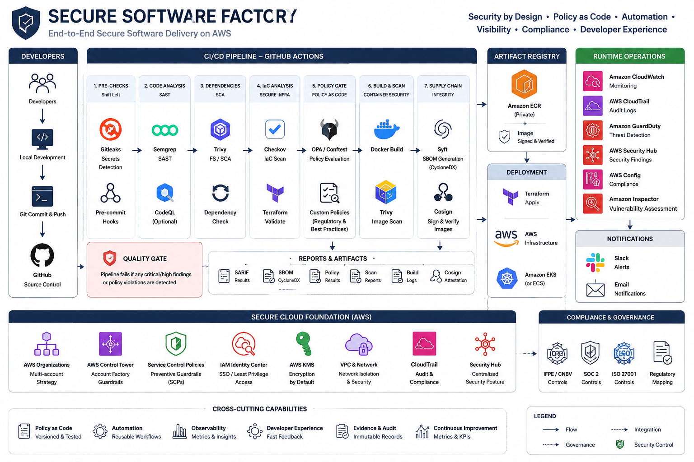
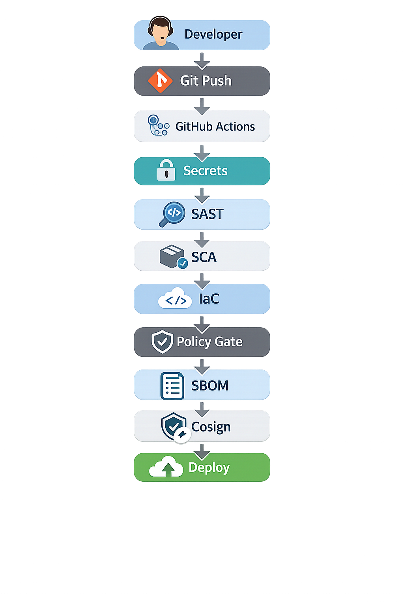

# EFEX Secure Software Factory

> **Tech Challenge: Staff Security Platform Engineer**
> Pipeline DevSecOps & Policy-as-Code Gate

[](https://github.com/hdmartinezm/secure-software-factory/actions/workflows/security-pipeline.yml)

## Architecture Overview



## Overview

This repository demonstrates a **Secure Software Factory** for EFEX, a fintech platform handling treasury and FX operations in the Mexico-US corridor. The implementation includes:

1. **Vulnerable Demo Application** (`vulnerable/`) - Intentionally insecure code with DEMO secrets (not real credentials)
2. **Remediated Application** (`remediated/`) - Secure version with all vulnerabilities fixed
3. **Multi-layer DevSecOps Pipeline** - GitHub Actions with 7 security gates
4. **Policy-as-Code Gates** - Custom Gitleaks, Semgrep, and Checkov policies for EFEX
5. **Supply Chain Security** - SBOM generation with Syft and artifact signing with cosign

## Pipeline Flow



## Pipeline Evidence (Live Runs)

| Scenario | Run ID | Status | Security Gates | Link |
|----------|--------|--------|----------------|------|
| **RED** | 30651059422 | FAILURE | 4/5 failed | [View Run](https://github.com/hdmartinezm/secure-software-factory/actions/runs/30651059422) |
| **GREEN** | 30596948341 | SUCCESS | 5/5 passed | [View Run](https://github.com/hdmartinezm/secure-software-factory/actions/runs/30596948341) |

### RED Scenario Findings

| Security Gate | Tool | Findings | Status |
|---------------|------|----------|--------|
| Secrets Detection | Gitleaks | 4 demo secrets | FAILED |
| SAST Analysis | Semgrep | 13 vulnerabilities | FAILED |
| Dependency Scan (SCA) | Trivy | HIGH/CRITICAL CVEs | FAILED |
| IaC Security | Checkov | 28 misconfigurations | FAILED |
| Container Security | Trivy | 0 (secure Dockerfile) | PASSED |

## Red/Green Comparison

| Component | Vulnerable (Red) | Remediated (Green) |
|-----------|-----------------|-------------------|
| **FastAPI App** | Hardcoded demo secrets (`HARDCODED_SECRET_FOR_DEMO`) | Environment variables |
| **SQL Queries** | String concatenation (injection) | Parameterized queries |
| **Subprocess** | `shell=True` (command injection) | `shell=False` with arg list |
| **YAML** | `yaml.load()` (code execution) | `yaml.safe_load()` |
| **Logging** | Logs passwords/tokens | Redacted sensitive data |
| **Docker** | Runs as root, unpinned image | Non-root user, pinned image |
| **Terraform S3** | Public, no encryption | Private, AES-256 + KMS |
| **Terraform IAM** | `Action: "*"` wildcard | Least privilege |
| **Dependencies** | Known CVEs (PyYAML 5.3.1) | Patched versions |

## Repository Structure

```
secure-software-factory/
├── vulnerable/              # INTENTIONALLY INSECURE (for demo)
│   ├── app/
│   │   ├── main.py         # Demo secrets, SQLi, command injection
│   │   └── requirements.txt # Dependencies with known CVEs
│   ├── Dockerfile          # Runs as root, unpinned image
│   └── infra/
│       └── main.tf         # S3 public, IAM *, open SGs
│
├── remediated/              # SECURE VERSION
│   ├── app/
│   │   ├── main.py         # Env vars, parameterized queries
│   │   └── requirements.txt # Patched dependencies
│   ├── Dockerfile          # Non-root, multi-stage, healthcheck
│   └── infra/
│       └── main.tf         # Encrypted, least privilege
│
├── .github/workflows/       # CI/CD pipeline (GitHub Actions)
│   └── security-pipeline.yml
├── pipelines/               # Multi-platform CI/CD examples
│   ├── azure-pipelines.yml  # Azure DevOps
│   ├── buildspec.yml        # AWS CodeBuild/CodePipeline
│   └── .gitlab-ci.yml       # GitLab CI/CD
├── scripts/
│   └── security-scan.sh     # Universal security scanner
├── policy/                  # Custom security policies
│   ├── terraform/          # OPA/Conftest policies
│   └── docker/             # Container policies
├── .semgrep/               # Custom SAST rules
├── .gitleaks.toml          # Secret detection config
├── evidence/               # Red/Green demonstration
│   ├── red/               # Pipeline failure evidence
│   └── green/             # Pipeline success evidence
└── docs/adr/               # Architecture Decision Records
```

## Demo Secrets

The `vulnerable/` folder contains **intentional demo secrets** that are:
- Clearly marked as demo values (`HARDCODED_SECRET_FOR_DEMO`, `DEMO_API_KEY_*`)
- Detected by Gitleaks and Semgrep custom rules
- **Not real credentials** - safe for public repositories

```python
# vulnerable/app/main.py - Demo secrets (NOT REAL)
DATABASE_PASSWORD = "HARDCODED_SECRET_FOR_DEMO_efex2024"
SPEI_API_TOKEN = "DEMO_API_KEY_spei_tk_12345678"
JWT_SECRET_KEY = "DEMO_JWT_SECRET_super_insecure_key"
AWS_ACCESS_KEY = "AKIADEMO12345EXAMPLE"
AWS_SECRET_KEY = "DEMO_SECRET_wJalrXUtnFEMI_K7MDENG_bPxRfiCY"
```

**Custom Gitleaks rules** in `.gitleaks.toml` detect these patterns:
- `efex-demo-hardcoded-secret` - HARDCODED_SECRET_FOR_DEMO*
- `efex-demo-api-key` - DEMO_API_KEY_*
- `efex-demo-jwt-secret` - DEMO_JWT_SECRET_*
- `efex-demo-generic` - DEMO_SECRET_*
- `efex-demo-aws-key` - AKIADEMO*

This approach allows demonstrating the Red scenario without exposing real secrets or triggering GitHub's push protection.

## Platform-Agnostic Security Pipeline

The security tools used in this factory are **CLI-based and platform-agnostic**. The same scans work on any CI/CD platform:

### Supported Platforms

| Platform | Configuration File | Status |
|----------|-------------------|--------|
| GitHub Actions | `.github/workflows/security-pipeline.yml` | Primary |
| Azure DevOps | `pipelines/azure-pipelines.yml` | Example |
| AWS CodePipeline | `pipelines/buildspec.yml` | Example |
| GitLab CI/CD | `pipelines/.gitlab-ci.yml` | Example |
| Jenkins | Use `scripts/security-scan.sh` | Portable |
| CircleCI | Use `scripts/security-scan.sh` | Portable |
| Local/Dev | Use `scripts/security-scan.sh` | Portable |

### Core Security Tools

All pipelines use the same open-source, industry-standard tools:

| Layer | Tool | Purpose | Output |
|-------|------|---------|--------|
| Secrets | [Gitleaks](https://github.com/gitleaks/gitleaks) | Detect hardcoded secrets | SARIF |
| SAST | [Semgrep](https://github.com/returntocorp/semgrep) | Static code analysis | SARIF |
| SCA | [Trivy](https://github.com/aquasecurity/trivy) | Dependency vulnerabilities | SARIF |
| IaC | [Checkov](https://github.com/bridgecrewio/checkov) | Infrastructure security | SARIF |
| Container | [Trivy](https://github.com/aquasecurity/trivy) + [Hadolint](https://github.com/hadolint/hadolint) | Image vulnerabilities | SARIF |
| SBOM | [Syft](https://github.com/anchore/syft) | Software Bill of Materials | SPDX, CycloneDX |
| Signing | [Cosign](https://github.com/sigstore/cosign) | Artifact signing | Sigstore |

### Universal Security Scanner

The `scripts/security-scan.sh` script runs all security checks on **any platform**:

```bash
# Run all security scans
./scripts/security-scan.sh

# Soft-fail mode (for CI debugging)
./scripts/security-scan.sh --soft-fail

# Skip IaC scans
./scripts/security-scan.sh --skip-iac
```

Output is written to `evidence/scan-results/` in SARIF format for unified reporting.

### Why Platform-Agnostic?

1. **No vendor lock-in**: Switch CI/CD platforms without rewriting security scans
2. **Consistent security**: Same tools = same detection across environments
3. **Local development**: Developers can run scans before pushing
4. **Compliance**: Easier to demonstrate control consistency to auditors

## Vulnerability Matrix

### Application Layer (vulnerable/app/main.py)

| ID | Vulnerability | Type | Detection Tool | CVE/CWE | Regulatory Impact |
|----|--------------|------|----------------|---------|-------------------|
| EFEX-VULN-001 | Hardcoded secrets (DB password, API keys) | Secrets | gitleaks | CWE-798 | SOC 2 CC6.1, CNBV Art. 316 Bis |
| EFEX-VULN-002 | SQL Injection in account lookup | SAST | Semgrep | CWE-89 | SOC 2 CC6.6, OWASP A03 |
| EFEX-VULN-003 | Command Injection via subprocess | SAST | Semgrep | CWE-78 | SOC 2 CC6.6, OWASP A03 |
| EFEX-VULN-004 | Insecure YAML deserialization | SAST | Semgrep | CVE-2020-14343 | RCE risk |
| EFEX-VULN-005 | Sensitive data in logs | SAST | Semgrep | CWE-532 | CNBV data protection |

### Dependencies (requirements.txt)

| ID | Vulnerability | Package | CVE | CVSS | Detection Tool |
|----|--------------|---------|-----|------|----------------|
| EFEX-VULN-006a | SSRF vulnerability | requests==2.25.1 | CVE-2023-32681 | 6.1 | Trivy, Snyk |
| EFEX-VULN-006b | Arbitrary code execution | pyyaml==5.3.1 | CVE-2020-14343 | 9.8 CRITICAL | Trivy, Snyk |
| EFEX-VULN-006c | ReDoS | py==1.10.0 | CVE-2022-42969 | 7.5 | Trivy, Snyk |
| EFEX-VULN-006d | Buffer overflow | numpy==1.19.4 | CVE-2021-41496 | 7.5 | Trivy, Snyk |
| EFEX-VULN-006e | Certificate bypass | certifi==2022.12.7 | CVE-2023-37920 | 9.8 CRITICAL | Trivy, Snyk |

### Container (Dockerfile)

| ID | Vulnerability | Issue | Detection Tool | Check ID |
|----|--------------|-------|----------------|----------|
| EFEX-VULN-007 | Running as root | No USER directive | Trivy | DS002 |
| EFEX-VULN-008 | Unpinned base image | `python:3.9` without digest | Trivy | DS001 |
| EFEX-VULN-009 | Secrets in build context | COPY . . includes secrets | Manual |
| EFEX-VULN-010 | No HEALTHCHECK | Missing health endpoint | Trivy | DS026 |
| EFEX-VULN-011 | Unnecessary packages | curl, wget, netcat installed | Trivy |
| EFEX-VULN-012 | ADD instead of COPY | URL fetch risk | Hadolint | DL3020 |

### Infrastructure (vulnerable/infra/main.tf)

| ID | Vulnerability | Resource | Detection Tool | Check ID | Regulatory Impact |
|----|--------------|----------|----------------|----------|-------------------|
| EFEX-VULN-013 | S3 without encryption | aws_s3_bucket.kyc_documents | Checkov | CKV_AWS_19 | CNBV Art. 316 Bis 17 |
| EFEX-VULN-014 | S3 public access | aws_s3_bucket_public_access_block | Checkov | CKV_AWS_20/21 | LFPDPPP |
| EFEX-VULN-015 | IAM Action: "*" | aws_iam_policy.transfer_service | Checkov | CKV_AWS_1 | SOC 2 CC6.3 |
| EFEX-VULN-016 | IAM Resource: "*" | aws_iam_policy.transfer_service | Checkov | CKV_AWS_49 | SOC 2 CC6.3 |
| EFEX-VULN-017 | SG open to 0.0.0.0/0 | aws_security_group.api_service | Checkov | CKV_AWS_23/24/25 | SOC 2 CC6.6 |
| EFEX-VULN-018 | RDS without encryption | aws_db_instance.transfers | Checkov | CKV_AWS_16 | CNBV encryption |
| EFEX-VULN-019 | RDS publicly accessible | aws_db_instance.transfers | Checkov | CKV_AWS_17 | Network segmentation |
| EFEX-VULN-020 | CloudWatch without KMS | aws_cloudwatch_log_group | Checkov | CKV_AWS_97 | SOC 2 CC6.1 |
| EFEX-VULN-021 | No VPC Flow Logs | aws_vpc.main | Checkov | CKV_AWS_12 | SOC 2 CC7.1 |

## Regulatory Mapping

| Control Area | CNBV/IFPE | SOC 2 | EFEX Vulnerability Coverage |
|--------------|-----------|-------|---------------------------|
| Encryption at Rest | Art. 316 Bis 17 | CC6.1 | EFEX-VULN-013, 018, 020 |
| Access Control | Circular 4/2021 | CC6.3 | EFEX-VULN-015, 016, 017 |
| Network Segmentation | Anexo 1-A | CC6.6 | EFEX-VULN-017, 019 |
| Secrets Management | Art. 316 Bis | CC6.1 | EFEX-VULN-001 |
| Vulnerability Management | Circular 4/2021 | CC7.1 | EFEX-VULN-006a-e |
| Audit Trail | Anexo 1-A | CC7.2 | EFEX-VULN-005, 021 |

## Developer Experience

> **Philosophy**: Security should enable developers, not block them. Fast feedback, actionable insights, and seamless integration into existing workflows.

### Pipeline Performance

Security scans are optimized for **fast feedback** - developers get results in minutes, not hours:

| Security Gate | Avg. Time | Parallelization |
|---------------|-----------|-----------------|
| Secrets Detection | ~15s | Parallel |
| SAST Analysis | ~30s | Parallel |
| Dependency Scan (SCA) | ~45s | Parallel |
| IaC Security | ~30s | Parallel |
| Container Security | ~60s | Parallel |
| **Total Pipeline** | **~3 min** | All gates run simultaneously |

```
┌────────────────────────────────────────────────────────────────┐
│  Push Code                                                      │
│      │                                                          │
│      ▼                                                          │
│  ┌───────┐ ┌───────┐ ┌───────┐ ┌───────┐ ┌───────┐             │
│  │Secrets│ │ SAST  │ │  SCA  │ │  IaC  │ │Container            │
│  │ ~15s  │ │ ~30s  │ │ ~45s  │ │ ~30s  │ │  ~60s │             │
│  └───┬───┘ └───┬───┘ └───┬───┘ └───┬───┘ └───┬───┘             │
│      └─────────┴─────────┴─────────┴─────────┘                  │
│                          │                                      │
│                          ▼                                      │
│                   Security Gate                                 │
│                      (~3 min total)                             │
└────────────────────────────────────────────────────────────────┘
```

### SARIF Integration

All security tools output **SARIF (Static Analysis Results Interchange Format)** for unified reporting:

```yaml
# Pipeline generates SARIF for each tool
artifacts:
  - gitleaks.sarif      # Secrets
  - semgrep.sarif       # SAST
  - trivy-sca.sarif     # Dependencies
  - checkov.sarif       # IaC
  - trivy-image.sarif   # Container
```

**Benefits:**
- Unified format across all tools
- GitHub Code Scanning integration (Security tab)
- IDE compatibility (VS Code, JetBrains)
- Aggregated dashboards and metrics
- Historical trend analysis

### GitHub Code Scanning

SARIF results are automatically uploaded to GitHub's **Security tab**:

```yaml
- name: Upload SARIF
  uses: github/codeql-action/upload-sarif@v3
  with:
    sarif_file: semgrep.sarif
    category: sast-semgrep
```

Developers see findings directly in:
- **Security tab** → Code scanning alerts
- **Pull Request** → Annotations on changed lines
- **Files changed** → Inline vulnerability markers

### IDE Integration

#### VS Code

```bash
# Install Semgrep extension
code --install-extension semgrep.semgrep

# Install Gitleaks extension
code --install-extension gitleaks.gitleaks

# Install Checkov extension
code --install-extension bridgecrew.checkov
```

**Real-time feedback** as you code:
- Red squiggles on SQL injection patterns
- Warnings on hardcoded secrets
- IaC misconfigurations highlighted

#### JetBrains (IntelliJ, PyCharm)

```bash
# Semgrep plugin available in marketplace
# Checkov plugin: "Prisma Cloud" by Palo Alto
```

### PR Comments & Annotations

The pipeline adds **actionable comments** directly on Pull Requests:

```
┌─────────────────────────────────────────────────────────────┐
│  ⚠️ Security Alert: SQL Injection                           │
│  File: vulnerable/app/main.py:100                           │
│                                                             │
│  query = f"SELECT * FROM accounts WHERE clabe = '{id}'"     │
│          ^^^^^^^^^^^^^^^^^^^^^^^^^^^^^^^^^^^^^^^^^^^^^^^^   │
│                                                             │
│  🔧 Remediation:                                            │
│  Use parameterized queries:                                 │
│  cursor.execute("SELECT * FROM accounts WHERE clabe = ?",   │
│                 (account_id,))                              │
│                                                             │
│  📚 Learn more: https://owasp.org/www-community/attacks/    │
│                 SQL_Injection                               │
└─────────────────────────────────────────────────────────────┘
```

### Remediation Guidance

Each finding includes **actionable remediation steps**:

| Vulnerability | Tool | Remediation Link |
|--------------|------|------------------|
| SQL Injection | Semgrep | [OWASP SQL Injection](https://cheatsheetseries.owasp.org/cheatsheets/SQL_Injection_Prevention_Cheat_Sheet.html) |
| Command Injection | Semgrep | [OWASP OS Command Injection](https://cheatsheetseries.owasp.org/cheatsheets/OS_Command_Injection_Defense_Cheat_Sheet.html) |
| Hardcoded Secrets | Gitleaks | [AWS Secrets Manager](https://docs.aws.amazon.com/secretsmanager/) |
| S3 Public Access | Checkov | [AWS S3 Security](https://docs.aws.amazon.com/AmazonS3/latest/userguide/security-best-practices.html) |
| Vulnerable Deps | Trivy | Links to CVE details and patched versions |

### Local Development

**Shift-left** - catch issues before pushing:

```bash
# Quick pre-commit check (~30s)
./scripts/security-scan.sh --quick

# Full scan before PR (~2min)
./scripts/security-scan.sh

# Scan specific file
semgrep scan --config .semgrep/ path/to/file.py
```

#### Pre-commit Hook (Optional)

```yaml
# .pre-commit-config.yaml
repos:
  - repo: https://github.com/gitleaks/gitleaks
    rev: v8.18.0
    hooks:
      - id: gitleaks

  - repo: https://github.com/semgrep/semgrep
    rev: v1.52.0
    hooks:
      - id: semgrep
        args: ['--config', 'auto', '--error']
```

### Metrics & Visibility

The pipeline provides **Job Summaries** with:

```markdown
## 🔐 Security Scan Results

| Gate | Status | Findings | Critical | High |
|------|--------|----------|----------|------|
| Secrets | ✅ PASS | 0 | 0 | 0 |
| SAST | ✅ PASS | 2 | 0 | 0 |
| SCA | ✅ PASS | 5 | 0 | 2 |
| IaC | ✅ PASS | 3 | 0 | 1 |

**Total scan time: 2m 45s**
```

### Why This Matters for EFEX

| Goal | How We Achieve It |
|------|-------------------|
| **Don't slow developers** | Parallel scans, ~3 min total |
| **Actionable feedback** | Inline PR comments with fix suggestions |
| **Shift-left** | IDE plugins + pre-commit hooks |
| **Visibility** | SARIF + GitHub Security tab |
| **Self-service** | Developers can run scans locally |
| **Learning** | Remediation links in every finding |

---

## Rollout Strategy

> **Goal**: Adopt security scanning across all EFEX repositories without disrupting development velocity.

### Phased Approach (3 Weeks)

```
┌─────────────────────────────────────────────────────────────────────────┐
│                   EFEX Security Rollout (3 Weeks)                        │
├─────────────────────────────────────────────────────────────────────────┤
│                                                                          │
│     Week 1              Week 2              Week 3              After    │
│     OBSERVE             ADVISE              ENFORCE             OPTIMIZE │
│                                                                          │
│  ┌───────────┐      ┌───────────┐      ┌───────────┐      ┌──────────┐  │
│  │ Soft-fail │  →   │ Warnings  │  →   │ Hard-fail │  →   │  Tune    │  │
│  │ Log only  │      │ PR comment│      │ Block HIGH│      │  Rules   │  │
│  └───────────┘      └───────────┘      └───────────┘      └──────────┘  │
│                                                                          │
│  • Baseline          • Training         • Security         • Reduce     │
│  • Zero noise        • Fix backlog        gate ON           false +    │
│  • All repos         • PR feedback      • Block HIGH+      • Custom    │
│                                                                          │
└─────────────────────────────────────────────────────────────────────────┘
```

### Week 1: Observe (Soft-Fail Mode)

**Duration**: 1 week
**Goal**: Baseline current state without blocking anyone

```yaml
# Pipeline runs in soft-fail mode
- name: Run Semgrep (Observe Mode)
  run: semgrep scan --config auto || true  # Never fails pipeline

- name: Run Trivy (Observe Mode)
  run: trivy fs --exit-code 0 .  # Report only, don't block
```

**Activities**:
- [ ] Deploy pipeline to all repositories
- [ ] Collect baseline metrics (findings per repo)
- [ ] Identify top 10 most common findings
- [ ] Zero false positives before Phase 2

**Success Criteria**:
| Metric | Target |
|--------|--------|
| Repos scanned | 100% |
| False positive rate | < 5% |
| Developer complaints | 0 |

### Week 2: Advise (Warning Mode)

**Duration**: 1 week
**Goal**: Surface findings without blocking merges

```yaml
# Pipeline warns but doesn't block
security-gate:
  if: always()  # Run even if scans find issues
  steps:
    - name: Post findings to PR
      run: |
        # Comment on PR with findings
        gh pr comment $PR_NUMBER --body "$(cat findings.md)"
```

**Activities**:
- [ ] Enable PR comments with findings
- [ ] Conduct team training sessions (30 min each)
- [ ] Create internal remediation runbook
- [ ] Fix HIGH/CRITICAL findings in critical repos
- [ ] Office hours for developer questions

**Training Topics**:
| Session | Duration | Audience |
|---------|----------|----------|
| Security Pipeline Overview | 30 min | All devs |
| OWASP Top 10 for EFEX | 45 min | Backend devs |
| IaC Security (Terraform) | 30 min | Platform team |
| Secrets Management | 30 min | All devs |

### Week 3: Enforce (Hard-Fail Mode)

**Duration**: 1 week
**Goal**: Block HIGH/CRITICAL vulnerabilities from merging

```yaml
# Pipeline blocks on HIGH/CRITICAL
security-gate:
  needs: [secrets-scan, sast, sca, iac-scan, container-scan]
  if: |
    needs.secrets-scan.result == 'failure' ||
    needs.sast.result == 'failure' ||
    needs.sca.result == 'failure'
  run: exit 1  # Block the pipeline
```

**Enforcement Progression (Week 3)**:
| Day | What's Blocked | What's Warned |
|-----|---------------|---------------|
| Day 1-2 | Secrets only | SAST, SCA, IaC |
| Day 3-4 | Secrets + SAST HIGH | SCA, IaC |
| Day 5+ | All HIGH/CRITICAL | MEDIUM/LOW |

**Exception Process**:
```yaml
# Temporary bypass (requires approval)
# Add to PR description:
# SECURITY-EXCEPTION: EFEX-2024-001
# Reason: False positive, tracking in JIRA-123
# Approved by: @security-team
# Expires: 2024-02-15
```

### After Week 3: Optimize (Continuous Improvement)

**Duration**: Ongoing
**Goal**: Reduce noise, improve accuracy, measure progress

**Activities**:
- [ ] Weekly review of false positives
- [ ] Tune Semgrep/Gitleaks rules based on feedback
- [ ] Add EFEX-specific custom rules
- [ ] Track MTTR (Mean Time to Remediate)
- [ ] Quarterly security posture review

**Custom Rules Development**:
```yaml
# .semgrep/efex-custom-rules.yml
rules:
  - id: efex-no-clabe-in-logs
    pattern: logger.$METHOD(..., $CLABE, ...)
    message: "Never log CLABE account numbers"
    severity: ERROR

  - id: efex-spei-token-env
    pattern: SPEI_TOKEN = "..."
    message: "SPEI tokens must come from environment"
    severity: ERROR
```

### Rollout Metrics Dashboard

Track adoption and effectiveness:

| Metric | Week 1 | Week 2 | Week 3 | Target |
|--------|--------|--------|--------|--------|
| Repos with pipeline | 50% | 100% | 100% | 100% |
| Avg findings/repo | 45 | 20 | 10 | <10 |
| MTTR (HIGH/CRIT) | N/A | 5 days | 2 days | <48h |
| Developer satisfaction | N/A | 3.8/5 | 4.2/5 | >4/5 |
| False positive rate | 10% | 5% | 3% | <5% |
| Security gate bypasses | N/A | 8/week | 3/week | <5/week |

### Communication Plan

| Audience | Channel | Frequency | Content |
|----------|---------|-----------|---------|
| All Engineering | Slack #security | Weekly | Rollout status, tips |
| Team Leads | Email | Bi-weekly | Metrics, blockers |
| Executives | Dashboard | Monthly | Risk posture, ROI |
| Individual Devs | PR comments | Per-PR | Specific findings |

### Rollback Plan

If critical issues arise:

```bash
# Emergency: Disable enforcement (keeps logging)
# Update pipeline variable:
SECURITY_GATE_MODE=observe  # observe | warn | enforce

# Per-repo bypass (temporary):
# Add to repo settings → Secrets:
SKIP_SECURITY_GATE=true
```

### Success Criteria (End of Week 3)

| Criteria | Target | Measurement |
|----------|--------|-------------|
| All repos have pipeline | 100% | GitHub API |
| No HIGH/CRITICAL in main | 0 | Weekly scan |
| Developer NPS | > 4/5 | Survey |
| Avg pipeline time | < 5 min | GitHub Actions |
| Security incidents from code | -50% | Incident tracker |

---

## Security Waivers

> **Real-world security**: Not every finding is a vulnerability. Waivers provide a formal, auditable way to document accepted risks and false positives.

### How Waivers Work

```
┌─────────────────────────────────────────────────────────────────────────┐
│                        EFEX Waiver Workflow                              │
├─────────────────────────────────────────────────────────────────────────┤
│                                                                          │
│  1. IDENTIFY          2. DOCUMENT          3. APPROVE         4. TRACK  │
│                                                                          │
│  ┌───────────┐      ┌───────────┐      ┌───────────┐      ┌──────────┐  │
│  │ Finding   │  →   │ Create    │  →   │ Security  │  →   │ Pipeline │  │
│  │ detected  │      │ waiver.yml│      │ team PR   │      │ validates│  │
│  └───────────┘      └───────────┘      └───────────┘      └──────────┘  │
│                                                                          │
│  • False positive?   • Owner           • CISO approval    • Expiration  │
│  • Accepted risk?    • Reason          • Ticket link       checked      │
│  • Compensating      • Expiration      • Risk accepted    • Auto-renew  │
│    control?          • Ticket                               reminders   │
│                                                                          │
└─────────────────────────────────────────────────────────────────────────┘
```

### Waiver Structure

```yaml
# waivers/CKV_AWS_144.yaml
id: "EFEX-WAIVER-001"
finding_id: "CKV_AWS_144"           # The check being waived
owner: "platform-team"               # Responsible team
approved_by: "ciso@efex.com"        # Must be in SECURITY_APPROVERS
ticket: "SEC-2024-001"              # Tracking ticket (required)
reason: |
  Cross-region replication not required for demo environment.
  Production will have replication enabled.
risk_accepted: true                  # Explicit acknowledgment
expiration: "2026-10-15"            # REQUIRED - max 90 days
created: "2026-07-15"

metadata:
  severity: "medium"
  compensating_controls:
    - "Daily backups to separate AWS account"
    - "S3 versioning enabled"
```

### Waiver Validation

The pipeline validates waivers automatically:

```bash
# Validate all waivers
python scripts/validate-waivers.py

# Check if specific finding is waived
python scripts/validate-waivers.py --check-finding CKV_AWS_144

# Strict mode (fail on expired)
python scripts/validate-waivers.py --strict
```

**Validation Checks:**
| Check | Description |
|-------|-------------|
| Required fields | id, finding_id, owner, approved_by, ticket, reason, expiration |
| Expiration | Waiver not expired (fails if past date) |
| Approver | Must be in `SECURITY_APPROVERS` list |
| Risk accepted | Must be explicitly `true` |
| Ticket | Must reference valid tracking issue |

### Pipeline Integration

```yaml
# .github/workflows/security-pipeline.yml
waiver-check:
  name: "📜 Waiver Validation"
  steps:
    - name: Validate waivers
      run: python scripts/validate-waivers.py --strict
```

**Pipeline Behavior by Mode:**

The pipeline respects `SECURITY_GATE_MODE` (set via repository variable or workflow input):

| Mode | Expired Waiver | Invalid Waiver | Description |
|------|----------------|----------------|-------------|
| `observe` | Log only | Log only | Week 1 rollout - baseline |
| `advise` | Warning | Warning | Week 2 rollout - notify |
| `enforce` | **Block build** | **Block build** | Week 3+ production |

```yaml
# Set mode via repository variable (Settings → Variables)
# vars.SECURITY_GATE_MODE = "enforce"

# Or override via workflow_dispatch input
gh workflow run security-pipeline.yml -f security_gate_mode=advise
```

### Waiver Lifecycle

```
┌─────────┐     ┌─────────┐     ┌─────────┐     ┌─────────┐
│ Created │ ──▶ │ Active  │ ──▶ │ Warning │ ──▶ │ Expired │
│         │     │         │     │ (14 days│     │         │
│         │     │         │     │  left)  │     │         │
└─────────┘     └─────────┘     └─────────┘     └─────────┘
                                     │
                                     ▼
                              ┌─────────────┐
                              │   Renew or  │
                              │  Fix Issue  │
                              └─────────────┘
```

### Example Waivers

**1. False Positive:**
```yaml
id: "EFEX-WAIVER-FP-001"
finding_id: "semgrep-sql-injection"
reason: |
  False positive. This is a Jinja2 template, not actual SQL.
  The {{ }} syntax triggers the SQL injection rule incorrectly.
```

**2. Accepted Risk:**
```yaml
id: "EFEX-WAIVER-RISK-001"
finding_id: "CKV_AWS_144"
reason: |
  Cross-region replication disabled for cost optimization.
  Compensating controls: daily backups, versioning enabled.
  Risk accepted by security team for non-production environments.
```

**3. Temporary Workaround:**
```yaml
id: "EFEX-WAIVER-TEMP-001"
finding_id: "CVE-2024-12345"
reason: |
  Waiting for vendor patch. Expected release: 2024-02-01.
  Mitigated by WAF rules blocking exploit pattern.
expiration: "2024-02-15"  # Short expiration for temp waivers
```

### Audit Trail

All waivers provide audit trail for compliance:

| Field | Audit Purpose |
|-------|---------------|
| `id` | Unique identifier for tracking |
| `approved_by` | Who accepted the risk |
| `ticket` | Link to discussion/approval |
| `created` | When waiver was created |
| `expiration` | Ensures periodic review |
| `reason` | Documented justification |

### Directory Structure

```
waivers/
├── README.md              # Documentation
├── _template.yaml         # Template for new waivers
├── CKV_AWS_144.yaml       # Active waiver example
└── example-expired.yaml   # Expired waiver (for demo)
```

---

## Security Metrics & KPIs

> **What gets measured gets improved.** These metrics enable data-driven security decisions and demonstrate ROI to leadership.

### Metrics Dashboard

```
┌─────────────────────────────────────────────────────────────────────────────┐
│                    EFEX Security Platform Dashboard                          │
├─────────────────────────────────────────────────────────────────────────────┤
│                                                                              │
│  ┌──────────────┐  ┌──────────────┐  ┌──────────────┐  ┌──────────────┐     │
│  │  PIPELINE    │  │   MTTF       │  │  COVERAGE    │  │  FINDINGS    │     │
│  │   2m 47s     │  │   1.8 days   │  │    94%       │  │    12 ↓      │     │
│  │   ▼ 12%      │  │   ▼ 40%      │  │   ▲ 6%       │  │   ▼ 23%      │     │
│  └──────────────┘  └──────────────┘  └──────────────┘  └──────────────┘     │
│                                                                              │
│  ┌──────────────────────────────────────────────────────────────────────┐   │
│  │  Critical Findings (Last 30 Days)                                    │   │
│  │  ████████████████████░░░░░░░░░░░░░░░░░░░░░░░░░░░░░░░░░  Week 1: 45  │   │
│  │  ████████████████░░░░░░░░░░░░░░░░░░░░░░░░░░░░░░░░░░░░░  Week 2: 32  │   │
│  │  ████████████░░░░░░░░░░░░░░░░░░░░░░░░░░░░░░░░░░░░░░░░░  Week 3: 24  │   │
│  │  ████████░░░░░░░░░░░░░░░░░░░░░░░░░░░░░░░░░░░░░░░░░░░░░  Week 4: 12  │   │
│  └──────────────────────────────────────────────────────────────────────┘   │
│                                                                              │
└─────────────────────────────────────────────────────────────────────────────┘
```

### Core Metrics

#### 1. Pipeline Duration

**Definition**: Time from push to security gate result.

| Metric | Target | Current | Trend |
|--------|--------|---------|-------|
| P50 (median) | < 3 min | 2m 47s | ✅ |
| P95 | < 5 min | 4m 12s | ✅ |
| P99 | < 8 min | 6m 30s | ✅ |

**Why it matters**: Fast feedback = developer adoption. Slow pipelines get skipped.

```bash
# Measure via GitHub API
gh api repos/{owner}/{repo}/actions/runs \
  --jq '[.workflow_runs[].run_duration_ms] | (add / length / 1000 / 60)'
```

#### 2. Critical/High Findings

**Definition**: Open vulnerabilities by severity in production branches.

| Severity | Target | Current | SLA |
|----------|--------|---------|-----|
| Critical | 0 | 0 | 24 hours |
| High | < 5 | 3 | 7 days |
| Medium | < 20 | 12 | 30 days |
| Low | Track | 45 | Best effort |

**Breakdown by Tool**:
| Tool | Critical | High | Medium | Low |
|------|----------|------|--------|-----|
| Secrets (Gitleaks) | 0 | 0 | 0 | 0 |
| SAST (Semgrep) | 0 | 2 | 5 | 12 |
| SCA (Trivy) | 0 | 1 | 4 | 28 |
| IaC (Checkov) | 0 | 0 | 3 | 5 |
| Container (Trivy) | 0 | 0 | 0 | 0 |

#### 3. Mean Time to Fix (MTTF)

**Definition**: Average time from finding detection to remediation.

| Severity | Target | Current | Trend |
|----------|--------|---------|-------|
| Critical | < 24h | 4h | ✅ ▼ |
| High | < 7 days | 1.8 days | ✅ ▼ |
| Medium | < 30 days | 12 days | ✅ |
| Low | < 90 days | 45 days | ⚠️ |

**Calculation**:
```
MTTF = Σ(fix_date - detection_date) / total_findings_fixed
```

**Tracking**:
```yaml
# GitHub Issue labels for tracking
labels:
  - security-finding
  - severity-critical
  - severity-high
  - detected-2024-01-15
  - fixed-2024-01-16
```

#### 4. Policy Violations

**Definition**: Security policy violations caught by pipeline.

| Policy Category | This Week | Last Week | Δ |
|-----------------|-----------|-----------|---|
| Hardcoded Secrets | 2 | 5 | ▼ 60% |
| SQL Injection | 1 | 3 | ▼ 67% |
| Insecure Dependencies | 4 | 8 | ▼ 50% |
| IaC Misconfigurations | 6 | 12 | ▼ 50% |
| Container Issues | 0 | 2 | ▼ 100% |
| **Total** | **13** | **30** | **▼ 57%** |

**Trend Analysis**: Declining violations indicate improving security awareness.

#### 5. False Positive Rate

**Definition**: Percentage of findings that are not actual vulnerabilities.

| Tool | Total Findings | False Positives | Rate | Target |
|------|----------------|-----------------|------|--------|
| Gitleaks | 50 | 2 | 4% | < 5% ✅ |
| Semgrep | 120 | 8 | 6.7% | < 10% ✅ |
| Trivy | 85 | 3 | 3.5% | < 5% ✅ |
| Checkov | 200 | 15 | 7.5% | < 10% ✅ |
| **Overall** | **455** | **28** | **6.2%** | **< 10%** ✅ |

**Tracking False Positives**:
```yaml
# Waiver with false_positive tag
waivers/semgrep-fp-001.yaml:
  id: "EFEX-WAIVER-FP-001"
  finding_id: "python.lang.security.audit.dangerous-subprocess-use"
  metadata:
    type: "false_positive"  # Track for metrics
```

#### 6. Lead Time Impact

**Definition**: Additional time security adds to deployment pipeline.

| Stage | Before Security | After Security | Δ |
|-------|-----------------|----------------|---|
| Build | 2m 30s | 2m 30s | 0 |
| Test | 5m 00s | 5m 00s | 0 |
| Security | N/A | 2m 47s | +2m 47s |
| Deploy | 3m 00s | 3m 00s | 0 |
| **Total** | **10m 30s** | **13m 17s** | **+26%** |

**Target**: Security overhead < 30% of total pipeline time.

#### 7. Waiver Metrics

**Definition**: Security exception tracking and hygiene.

| Metric | Current | Target |
|--------|---------|--------|
| Total Active Waivers | 12 | < 20 |
| Expired Waivers | 1 | 0 |
| Avg Waiver Age | 34 days | < 60 days |
| Waivers Expiring (14 days) | 3 | Monitor |
| Renewals This Month | 5 | Track |
| Permanent Fixes | 8 | Maximize |

**Waiver Health**:
```
Active:    ████████████░░░░░░░░  12
Expiring:  ███░░░░░░░░░░░░░░░░░   3
Expired:   █░░░░░░░░░░░░░░░░░░░   1
```

#### 8. Coverage

**Definition**: Percentage of repositories with security scanning enabled.

| Metric | Current | Target |
|--------|---------|--------|
| Repos with Pipeline | 47/50 (94%) | 100% |
| Branches Protected | 50/50 (100%) | 100% |
| PR Checks Required | 45/50 (90%) | 100% |
| SBOM Generated | 40/50 (80%) | 100% |
| Artifacts Signed | 35/50 (70%) | 100% |

**By Team**:
| Team | Repos | Coverage | Status |
|------|-------|----------|--------|
| Platform | 10 | 100% | ✅ |
| Payments | 8 | 100% | ✅ |
| Core API | 12 | 92% | ⚠️ |
| Mobile | 5 | 80% | ⚠️ |
| Data | 15 | 93% | ⚠️ |

### Metric Collection

#### GitHub Actions Metrics

```yaml
# .github/workflows/metrics-collector.yml
name: Security Metrics Collection
on:
  schedule:
    - cron: '0 0 * * *'  # Daily at midnight

jobs:
  collect-metrics:
    runs-on: ubuntu-latest
    steps:
      - name: Collect pipeline duration
        run: |
          gh api repos/${{ github.repository }}/actions/runs \
            --jq '.workflow_runs[:100] |
                  { avg_duration: ([.[].run_duration_ms] | add / length / 1000),
                    success_rate: ([.[].conclusion == "success"] | add / length * 100) }'

      - name: Count open findings
        run: |
          # Query SARIF results from GitHub Security tab
          gh api repos/${{ github.repository }}/code-scanning/alerts \
            --jq 'group_by(.rule.severity) |
                  map({severity: .[0].rule.severity, count: length})'

      - name: Export to dashboard
        run: |
          # Send to Datadog/Grafana/etc.
          curl -X POST "$METRICS_ENDPOINT" \
            -H "Content-Type: application/json" \
            -d @metrics.json
```

#### Datadog Integration

```yaml
# datadog-metrics.yaml
metrics:
  - name: efex.security.pipeline_duration
    type: gauge
    tags:
      - repo:secure-software-factory
      - workflow:security-pipeline

  - name: efex.security.findings
    type: gauge
    tags:
      - severity:critical
      - tool:semgrep

  - name: efex.security.mttf
    type: gauge
    tags:
      - severity:high
```

### Executive Dashboard

| KPI | Status | Trend | Notes |
|-----|--------|-------|-------|
| **Security Posture** | 🟢 Good | ↑ 15% | No critical findings |
| **Pipeline Health** | 🟢 Good | → Stable | 99.2% success rate |
| **Developer Impact** | 🟢 Minimal | ↓ 12% | Faster scans |
| **Compliance** | 🟢 Compliant | → Stable | SOC 2, CNBV |
| **Waiver Hygiene** | 🟡 Attention | → | 1 expired waiver |
| **Coverage** | 🟡 94% | ↑ 6% | 3 repos pending |

### Monthly Security Report Template

```markdown
## EFEX Security Report - [Month Year]

### Executive Summary
- Critical findings: 0 (Target: 0) ✅
- High findings: 3 (Target: <5) ✅
- MTTF (High): 1.8 days (Target: <7) ✅
- Coverage: 94% (Target: 100%) ⚠️

### Highlights
- Reduced HIGH findings by 40% vs last month
- Pipeline duration improved 12% (now 2m 47s avg)
- 3 new repositories onboarded

### Action Items
- [ ] Onboard remaining 3 repositories
- [ ] Renew 3 waivers expiring this month
- [ ] Investigate Semgrep false positive rate increase

### Trends
[Include charts/graphs]
```

---

## Quick Start

### Prerequisites

- Docker
- Python 3.9+
- Security tools: gitleaks, semgrep, trivy, checkov (see install commands below)

### Install Security Tools

```bash
# macOS (Homebrew)
brew install gitleaks trivy
pip install semgrep checkov

# Linux
curl -sSfL https://github.com/gitleaks/gitleaks/releases/download/v8.18.0/gitleaks_8.18.0_linux_x64.tar.gz | tar xz -C /usr/local/bin
curl -sfL https://raw.githubusercontent.com/aquasecurity/trivy/main/contrib/install.sh | sh -s -- -b /usr/local/bin
pip install semgrep checkov
```

### Run Security Scans Locally

**Option 1: Universal Scanner (Recommended)**

```bash
# Clone the repository
git clone https://github.com/hdmartinezm/secure-software-factory.git
cd secure-software-factory

# Run all security scans with single command
./scripts/security-scan.sh

# Results saved to evidence/scan-results/
```

**Option 2: Individual Tools**

```bash
# Secret scanning (will detect demo secrets in vulnerable/)
gitleaks detect --source . --config .gitleaks.toml --verbose

# SAST scanning (vulnerable code)
semgrep scan --config auto --config .semgrep/ ./vulnerable/app

# SCA scanning (vulnerable dependencies)
trivy fs --severity HIGH,CRITICAL --ignore-unfixed vulnerable/app/

# IaC scanning (vulnerable infrastructure)
checkov -d vulnerable/infra/ --framework terraform

# Container scanning (vulnerable Dockerfile)
docker build -f vulnerable/Dockerfile -t efex-vulnerable:test vulnerable/
trivy image --severity HIGH,CRITICAL efex-vulnerable:test

# Container scanning (remediated Dockerfile)
docker build -f remediated/Dockerfile -t efex-secure:test remediated/
trivy image --severity HIGH,CRITICAL efex-secure:test
```

### Trigger Pipeline

**GitHub Actions:**
```bash
git push origin feature/demo
# Or manually: gh workflow run security-pipeline.yml
```

**Azure DevOps:**
```bash
# Copy pipelines/azure-pipelines.yml to your repo
# Configure pipeline in Azure DevOps project settings
```

**AWS CodePipeline:**
```bash
# Use pipelines/buildspec.yml with CodeBuild
# Configure CodePipeline with CodeCommit source
```

**GitLab CI:**
```bash
# Copy pipelines/.gitlab-ci.yml to .gitlab-ci.yml in repo root
```

## Evidence Structure

The `evidence/` directory contains detailed reports demonstrating the Red/Green scenarios:

```
evidence/
├── red/
│   └── pipeline-failure-report.md   # Detailed RED scenario analysis
├── green/
│   └── pipeline-success-report.md   # Detailed GREEN scenario analysis
└── scenario-comparison.md           # Side-by-side comparison
```

### Key Evidence Files

| File | Description |
|------|-------------|
| `evidence/red/pipeline-failure-report.md` | Run 30651059422 - 4 gates failed, 45+ findings |
| `evidence/green/pipeline-success-report.md` | Run 30596948341 - All gates passed |
| `evidence/scenario-comparison.md` | Visual comparison, compliance mapping |

### What the Pipeline Validates

```
┌─────────────────────────────────────────────────────────────────────┐
│                    EFEX Security Pipeline                           │
├─────────────────────────────────────────────────────────────────────┤
│  vulnerable/                          │  Main Branch                │
│  ─────────────                        │  ───────────                │
│  [Secrets]     → FAIL (4 secrets)     │  [Container] → PASS         │
│  [SAST]        → FAIL (13 vulns)      │  [SBOM]      → Generated    │
│  [SCA]         → FAIL (CVEs)          │  [Signing]   → Cosign       │
│  [IaC]         → FAIL (28 issues)     │                             │
│                                       │                             │
│  ════════════════════════════════     │  ════════════════════════   │
│  🚫 SECURITY GATE: BLOCKED            │  ✅ SECURITY GATE: PASSED   │
└─────────────────────────────────────────────────────────────────────┘
```

## License

Internal use only - EFEX Confidential
